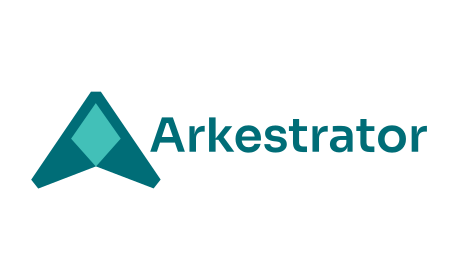

# Arkestrator



**AI orchestration for creative tools. One hub connects your DCC apps, your AI engines, and your team.**

Arkestrator is an open-source hub-and-spoke system that lets AI agents work directly inside Godot, Blender, Houdini, Unreal Engine, Unity, Fusion/DaVinci Resolve, and ComfyUI. You manage everything from one desktop client, and the server handles queueing, routing, and execution.

Pre-release legal notice: see [DISCLAIMER.md](DISCLAIMER.md).

## Why Arkestrator?

Creative AI workflows today are fragmented. You copy prompts between terminals and editors, build separate integrations per app, and lose all coordination once work spans multiple tools or machines.

**MCP alone doesn't solve this.** MCP gives an AI agent a set of tools to call, but it doesn't give you:

- A **job queue** with priorities, dependencies, and retry logic
- **Multi-machine routing** so your DCC app runs on one workstation and the AI runs on another
- **Live editor context** from inside your creative tools (selected nodes, open scenes, project structure)
- **Team controls** with user accounts, API keys, policies, and audit logging
- **Engine flexibility** to swap between Claude Code, Codex, Gemini, Grok, local models, or any CLI without rebuilding your pipeline

Arkestrator provides all of this. It also exposes its own MCP endpoint, so external AI clients can submit jobs and execute bridge commands through the standard MCP protocol.

## How It Works

Arkestrator uses a hub-and-spoke model with three components:

1. **Server** (the hub) — Manages the job queue, spawns AI agents, routes commands, handles auth and policies
2. **Client** (desktop app) — Your control panel. Submit prompts, monitor jobs, configure agents, manage projects
3. **Bridges** (spokes) — Lightweight plugins inside each DCC app that push editor context and execute results

```
                    ┌──────────────────────┐
                    │   Desktop Client     │
                    │  (Tauri + Svelte 5)  │
                    │                      │
                    │  Chat · Jobs · Admin │
                    └──────────┬───────────┘
                               │
                    ┌──────────▼───────────┐
                    │   Arkestrator Server  │
                    │   (Bun + Hono + SQLite)│
                    │                      │
                    │  Queue · Route · Run │
                    │  Auth · Policy · Logs│
                    └──────────┬───────────┘
                               │
           ┌───────────────────┼───────────────────┐
           │           │           │           │
     ┌─────▼─────┐ ┌──▼──┐ ┌─────▼─────┐ ┌──▼──────┐
     │   Godot   │ │Blender│ │  Houdini  │ │  More   │
     │  (bridge) │ │(bridge)│ │  (bridge) │ │ bridges │
     └───────────┘ └───────┘ └───────────┘ └─────────┘

  AI Engines: Claude Code · Codex · Gemini · Grok · Ollama · Any CLI
```

### The Workflow

1. **Connect bridges** — Install the bridge plugin in your DCC app. It auto-discovers the server via `~/.arkestrator/config.json` (written by the desktop client on login) and connects over WebSocket. The bridge continuously pushes editor context (active scene, selected nodes, open scripts) to the server.

2. **Submit from the client** — Open the desktop client, write your prompt in the Chat page, pick an AI engine and target bridge, then submit. The server queues the job, resolves the workspace mode, and spawns the AI agent as a subprocess.

3. **Agent executes** — The AI agent (Claude Code, Codex, Ollama, etc.) runs with full context: your prompt, editor state, attached files, and coordinator scripts. It can send commands to bridges, read/write project files, and call MCP tools.

4. **Results flow back** — File changes are applied directly in your DCC app. Commands (GDScript, Python, HScript) execute inside the editor. You see logs streaming in real-time in the desktop client.

## Supported Integrations

### Bridges

Bridge plugins connect DCC apps (Godot, Blender, Houdini, Unreal Engine 5, Unity, Fusion/DaVinci Resolve, ComfyUI) to the server via WebSocket. Any program that can open a WebSocket and run scripts can become a bridge.

See the [arkestrator-bridges](https://github.com/timvanhelsdingen/arkestrator-bridges) repository for installation, supported apps, and context details. See the [Bridge Development Guide](docs/bridge-development.md) for building your own.

### AI Engines

| Engine | CLI | Status |
|---|---|---|
| Claude Code | `claude` | Extensively tested |
| Codex | `codex` | Extensively tested |
| Gemini CLI | `gemini` | Supported |
| Grok | `grok` | Supported |
| Ollama (local) | `ollama` | Supported (agentic loop) |
| Any CLI | Custom command | Bring your own |

## Install

### Desktop App

Download the latest installer from [GitHub Releases](https://github.com/timvanhelsdingen/arkestrator/releases):

| Platform | Format |
|---|---|
| Windows | `.exe` installer (NSIS) |
| macOS | `.dmg` disk image |
| Linux | `.rpm`, `.deb`, `.AppImage` |

The desktop app bundles the server as a sidecar binary. Install, launch, and you're running.

### Linux (Quick Install)

```bash
curl -fsSL https://raw.githubusercontent.com/timvanhelsdingen/arkestrator/main/install.sh | bash
```

Installs the server and/or desktop app interactively. Use `--server`, `--desktop`, or `--both` for non-interactive install. Run with `--uninstall` to remove.

### Standalone Server

For headless, remote, or Docker deployments:

```bash
# Download standalone binary from Releases (no runtime needed)
./arkestrator-server-linux-x64
./arkestrator-server-darwin-arm64
./arkestrator-server-win-x64.exe
```

### Docker

```bash
docker pull ghcr.io/timvanhelsdingen/arkestrator:latest
docker run -p 7800:7800 -v arkestrator-data:/data ghcr.io/timvanhelsdingen/arkestrator:latest
```

See [deployment docs](docs/deployment-vps-caddy.md) for production setup with HTTPS.

### Build from Source

Requires: [Node.js 20+](https://nodejs.org), [pnpm](https://pnpm.io), [Bun](https://bun.sh), [Rust](https://rustup.rs) (for desktop client only).

```bash
git clone https://github.com/timvanhelsdingen/arkestrator.git
cd arkestrator

pnpm install
pnpm --filter @arkestrator/protocol build

# Dev mode (server + client)
pnpm dev

# Production build
pnpm build:sidecar
pnpm --filter @arkestrator/admin build
cd client && pnpm tauri build
```

## First Run

1. Launch the desktop app. It starts the server automatically on port 7800.
2. First login credentials are in `bootstrap-admin.txt` in your app data directory (the setup page shows the exact path).
3. Log in and go to **Admin > Agents > Add from Template** to create your first agent config (Claude Code, Codex, Ollama, etc.).
4. Install a bridge plugin in your DCC app. It auto-connects using the shared config written by the desktop client.
5. Submit your first prompt from the Chat page.

## MCP Support

Arkestrator exposes an MCP endpoint at `/mcp` for external AI clients. Any MCP-compatible tool can submit jobs, execute bridge commands, and query job status through the standard MCP protocol. Authenticate with a Bearer token from the Admin > API Keys page.

## Key Features

- **Multi-tab chat** with per-tab agent selection, runtime overrides (model, reasoning level, verification), and project context
- **Job queue** with priorities, dependencies, pause/resume, requeue, and worker targeting
- **Live log streaming** from running agents directly in the client
- **Running-job guidance** — send notes to running agents mid-execution
- **Coordinator system** — inject DCC-specific scripts, playbooks, and training data into agent prompts
- **Workspace modes** — `repo` (direct file access), `command` (in-app execution), or `sync` (file upload/download for remote setups)
- **Auto-routing** — set agent to "Auto" and the server picks the best engine based on prompt complexity
- **Local models** via Ollama with an agentic loop, per-worker GPU gating, and distributed model management
- **Headless execution** — run Blender, Houdini, or Godot CLI operations without a GUI bridge
- **Cross-bridge commands** — one bridge can send commands to another (e.g., Blender sends GDScript to Godot)
- **Web admin panel** for user management, agent configs, policies, machine inventory, and audit logging, embedded directly in the desktop client with automatic session handoff and remote-server iframe support
- **Context menu integration** in every supported DCC app — right-click to add items to the AI's context

## Documentation

- **[Docs Index](docs/INDEX.md)** — All docs in one place
- **[How It Works](docs/how-it-works.md)** — Hub-and-spoke model, job lifecycle, workspace modes
- **[Architecture](docs/architecture.md)** — Component design and technology choices
- **[Installation](docs/installation.md)** — Desktop, server, Docker, build from source
- **[Configuration](docs/configuration.md)** — Environment variables reference
- **[Desktop Client](docs/usage-client.md)** — Using the Tauri desktop app
- **[Server & API](docs/usage-server.md)** — REST API, WebSocket, MCP integration
- **[Bridge Usage](docs/usage-bridges.md)** — Using bridges from the DCC side
- **[Bridge Development](docs/bridge-development.md)** — Build a bridge for a new tool
- **[Deployment](docs/deployment-vps-caddy.md)** — Production Docker with Caddy/HTTPS
- **[Contributing](docs/contributing.md)** — Developer workflow and standards

## Support the Project

If Arkestrator is useful to you, consider supporting development:

- [GitHub Sponsors](https://github.com/sponsors/timvanhelsdingen)
- [Ko-fi](https://ko-fi.com/timvanhelsdingen)
- [Patreon](https://patreon.com/timvanhelsdingen)

## License

- Licensed under the [MIT License](LICENSE)
- Provided "AS IS", without warranty of any kind
- Use at your own risk; keep backups before agent-driven operations
- See [DISCLAIMER.md](DISCLAIMER.md)
